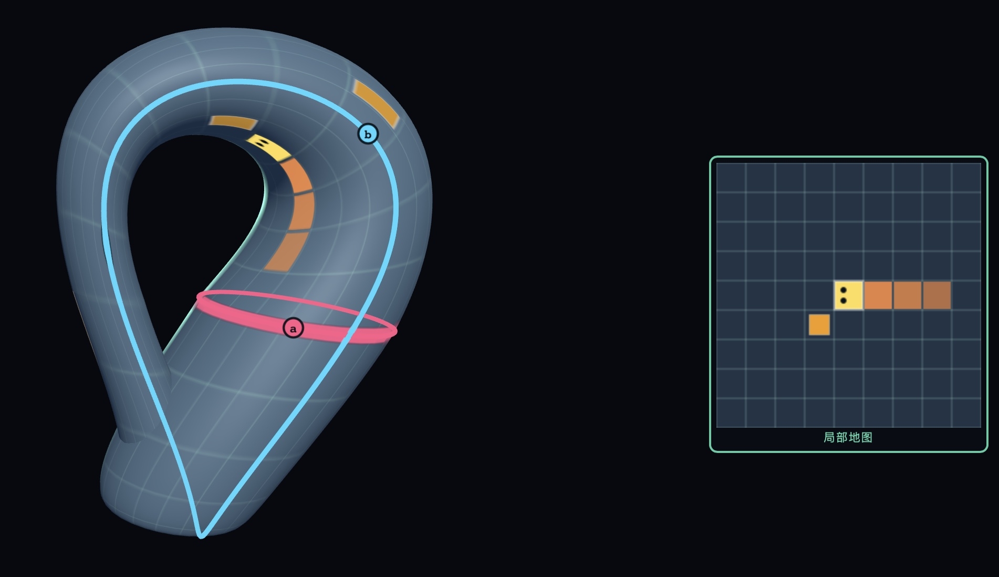

# Snake on Surfaces

Snake on Surfaces is a browser game that turns the classic snake mechanic into a topology playground. Instead of moving on a flat rectangle, the snake lives on surfaces such as the sphere, torus, genus-2 surface, Mobius strip, projective plane, and Klein bottle.



The goal is usually to form an Ouroboros: the snake closes into a loop. Different surfaces use different winning conditions, so the game makes fundamental-group and surface-identification ideas visible through play.

## Features

- Six playable surfaces: sphere, torus, genus 2, Mobius strip, projective plane (cross-cap), and Klein bottle.
- Side-by-side manifold and local chart views, with the chart boundary marked on the surface.
- Surface-specific loop detection.
- Optional topology hints showing cuts and the current group calculation.
- English and Chinese UI.
- Continuous movement with hold-to-steer keyboard and touch controls.
- Mobile 3D gestures: one-finger rotate, two-finger pinch zoom.

## Play

Open `index.html` in a browser and choose a surface.

## Controls

Desktop:

- Hold Left/Right or A/D: turn the snake; release to continue forward
- P or Space: pause
- Drag the 3D view: rotate the surface
- Mouse wheel: zoom
- R or Reset Camera: reset the view

Mobile:

- Hold the left/right half of the chart or touch band: turn left/right
- Drag the 3D view with one finger: rotate the surface
- Pinch the 3D view with two fingers: zoom

## Winning Goals

- Sphere: form any closed loop.
- Torus: form a nontrivial loop.
- Genus 2: form a nontrivial loop.
- Projective plane: use temporary portals to change local sides, then form a nontrivial loop on the original surface; teleportation adds no winding and leaves the surface intact.
- Mobius strip: form a nontrivial loop without crossing the boundary.
- Klein bottle: form a nontrivial loop.

## Customization

Visual settings are in `snake3d.html`, `clay-actors.js`, `chart-view.js`, and `style.css`; movement settings are in `continuous-snake.js`, with local coordinates in `surface-atlas.js`.

- Initial speed: `INITIAL_SPEED_MS`. Smaller values are faster.
- Genus-2 default camera: `GENUS2_CAMERA_POSITION`.
- Mobile camera zoom: `MOBILE_CAMERA_DISTANCE_SCALE`. Smaller values zoom in more on mobile.
- Snake length, radius, and turning speed: `initialLength`, `segmentLength`, `radius`, `turnRate`. Start with 4 segments; each growth food adds one segment (0.15 length units).
- Projective-plane portals: `PROJECTIVE_PORTALS` in `snake3d.html`. Start with one; every 5 seconds of play, a 40% chance to spawn another, up to two. Each lasts 60 seconds and remains active until the tail teleports.
- Food weights and colors: `FOOD_DEF`.

The index page previews can either use the built-in rotating 3D previews or custom images. To use a custom image, set `data-image` on a `.map-card` in `index.html`.

## Repository

GitHub: <https://github.com/lixingying/snake3D>

## Rights, License, and Attribution

Copyright 2026 Xingying Li.

This project is licensed under the Apache License, Version 2.0. See `LICENSE` and `NOTICE`.

In practical terms, this means others may use, copy, modify, and distribute the code, but they must keep the copyright notice, the license text, and the NOTICE attribution. Modified versions should also make clear that they changed the original work.

Suggested attribution:

```text
Based on Snake on Surfaces by Xingying Li.
```

If you publish a modified version, please keep the project name and author attribution in the source, documentation, or credits area.

## 中文说明

# 蛇蛇教你学拓扑

Snake on Surfaces 是一个把经典贪吃蛇玩法放到拓扑曲面上的浏览器游戏。蛇不再生活在普通平面上，而是在球面、环面、双孔曲面、莫比乌斯带、射影平面、克莱因瓶等曲面上移动。

游戏目标通常是形成 衔尾蛇，也就是蛇首尾相接形成闭合环路。不同曲面有不同的胜利条件，因此玩家可以在游戏中直观看到基本群、边粘合、cut 和非平凡环路等概念。

## 功能

- 六张曲面地图：球面、环面、双孔曲面、莫比乌斯带、射影平面（交叉帽）、克莱因瓶。
- 左侧 3D 曲面、右侧局部地图，曲面上的边线标出局部地图对应的范围。
- 针对不同曲面的环路判定。
- 可选拓扑提示：显示 cut 和当前群计算。
- 英文和中文界面。
- 连续自由移动，支持键盘和触屏按住转向。
- 手机端 3D 手势：单指旋转，双指捏合缩放。

## 运行

用浏览器打开 `index.html`，然后选择曲面即可。

## 操作

桌面端：

- 按住左/右方向键或 A/D：持续转向；松开后继续向前
- P 或空格：暂停
- 拖拽 3D 视图：旋转曲面
- 鼠标滚轮：缩放
- R 或重置视角：重置视图

手机端：

- 按住局部地图或触控区域的左/右半边：向左/右转向
- 在 3D 视图单指拖拽：旋转曲面
- 在 3D 视图双指捏合：缩放

## 胜利目标

- 球面：形成任意闭合环路。
- 环面：形成非平凡环路。
- 双孔曲面：形成非平凡环路。
- 射影平面：通过限时传送点切换局部侧，再形成原曲面上的非平凡环路；传送不增加绕行，曲面保持完整。
- 莫比乌斯带：形成不跨边界的非平凡环路。
- 克莱因瓶：形成非平凡环路。

## 自定义参数

画面设置在 `snake3d.html`、`clay-actors.js`、`chart-view.js` 和 `style.css` 中，运动参数在 `continuous-snake.js` 中，局部坐标在 `surface-atlas.js` 中。

- 初始速度：`INITIAL_SPEED_MS`。数值越小，蛇越快。
- 双孔曲面默认相机：`GENUS2_CAMERA_POSITION`。
- 手机端相机距离：`MOBILE_CAMERA_DISTANCE_SCALE`。数值越小，手机端越放大。
- 蛇的长度、粗细和转向速度：`initialLength`、`segmentLength`、`radius`、`turnRate`。初始 4 节，每个增长食物增加 1 节，每节长度为 0.15。
- 射影平面传送点：`snake3d.html` 中的 `PROJECTIVE_PORTALS`。开局一个，游玩时每 5 秒有 40% 概率新增，同时最多两个；持续 60 秒，蛇身尚在传送时等蛇尾通过再消失。
- 食物权重和颜色：`FOOD_DEF`。

首页预览可以使用内置的旋转 3D 预览，也可以换成自己的图片。要换图，在 `index.html` 的 `.map-card` 上填写 `data-image`。

## 权利、许可证与署名

版权所有 2026 Xingying Li。

本项目基于 Apache License, Version 2.0 发布。请查看 `LICENSE` 和 `NOTICE`。

通俗地说，别人可以使用、复制、修改和发布这份代码，但必须保留版权声明、许可证文本和 NOTICE 署名信息。修改版本也应该说明它是基于原作修改的。

建议署名格式：

```text
Based on Snake on Surfaces by Xingying Li.
```

如果别人发布修改版，请在源码、文档或致谢区域保留项目名称和作者署名。
